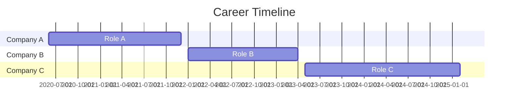

# Professional Portfolio

<div align="right">
  <a href="#professional-portfolio">Back to Top ↑</a>
</div>

## Quick Navigation
- [Personal Website](#personal-website)
- [Education and Awards](#education-and-awards)
- [Latin Honors Portfolio](#latin-honors-portfolio)
- [Professional Experience](#professional-experience)
- [Skills](#skills)

---

## Personal Website

<div align="center">


</div>

Welcome to my professional portfolio! I am a dedicated [your profession] passionate about [your interests/specialization]. This README serves as a comprehensive overview of my academic and professional journey.

### Connect With Me
[](https://linkedin.com/in/yourusername)
[](https://github.com/yourusername)
[](https://yourwebsite.com)
[](mailto:your.email@example.com)

<div align="right">
  <a href="#professional-portfolio">Back to Top ↑</a>
</div>

---

## Education and Awards

### Education
- **[University Name]** - [Degree Type] in [Major], *Graduation Year*
  - GPA: [Your GPA]/4.0
  - Thesis: "[Thesis Title]"
  - Advisor: [Advisor Name]
  
- **[Previous University/School]** - [Degree/Diploma], *Year*
  - [Relevant coursework or achievements]

### Academic Awards
| Award | Organization | Year |
|-------|-------------|------|
| [Award Name] | [Awarding Organization] | [Year] |
| [Scholarship Name] | [Organization] | [Year] |
| [Honor Society] | [Chapter] | [Year] |

### Certifications
- **[Certification Name]** - [Issuing Organization], *Expiration Date*
- **[Certification Name]** - [Issuing Organization], *Expiration Date*

<div align="right">
  <a href="#professional-portfolio">Back to Top ↑</a>
</div>

---

## Latin Honors Portfolio

<div align="center">
  
  
  
</div>

### Thesis Abstract
```
[Your thesis abstract goes here. This section provides a brief summary of your research, methodology, findings, and conclusions.]
```

### Distinguished Projects
<details>
  <summary><strong>Research Project: [Project Title]</strong></summary>
  
  #### Overview
  [Brief description of the project]
  
  #### Methodology
  [Description of your approach]
  
  #### Results
  [Summary of findings]
  
  #### Impact
  [Explanation of significance]
  
  #### Publications/Presentations
  - [Citation or link to published work]
  - [Conference presentation details]
</details>

<details>
  <summary><strong>Capstone Project: [Project Title]</strong></summary>
  
  #### Description
  [Project details]
  
  #### Technologies Used
  - [Technology 1]
  - [Technology 2]
  
  #### Outcomes
  [Results and achievements]
  
  #### Repository
  [Link to GitHub repository if applicable]
</details>

### Academic References
- **[Professor Name]** - [Position], [Department]
  - Contact: [Email or professional link]
  - Relationship: [Brief description of academic relationship]

<div align="right">
  <a href="#professional-portfolio">Back to Top ↑</a>
</div>

---

## Professional Experience

<div align="center">
  


</div>

### [Current/Most Recent Job Title] | [Company Name] | [Start Date - End Date/Present]


- [Key responsibility or achievement with measurable results]
- [Key responsibility or achievement with measurable results]
- [Key responsibility or achievement with measurable results]
- **Technologies used:** [List relevant technologies, tools, or methodologies]

### [Previous Job Title] | [Company Name] | [Start Date - End Date]


- [Key responsibility or achievement with measurable results]
- [Key responsibility or achievement with measurable results]
- [Key responsibility or achievement with measurable results]
- **Technologies used:** [List relevant technologies, tools, or methodologies]

### [Previous Job Title] | [Company Name] | [Start Date - End Date]


- [Key responsibility or achievement with measurable results]
- [Key responsibility or achievement with measurable results]
- **Technologies used:** [List relevant technologies, tools, or methodologies]

<div align="right">
  <a href="#professional-portfolio">Back to Top ↑</a>
</div>

---

## Skills

<div align="center">

### Technical Skills


### Tools & Platforms


</div>

### Skill Proficiency

```
Programming Languages
├── JavaScript ███████████░░ 90%
├── Python     ████████████░ 95%
├── Java       ██████████░░░ 80%
├── SQL        ████████░░░░░ 70%
└── C++        ██████░░░░░░░ 60%

Frameworks & Libraries
├── React      ████████████░ 95%
├── Node.js    ██████████░░░ 80%
├── Django     ███████████░░ 90%
└── Express    ████████░░░░░ 70%

Other Skills
├── Project Management ███████████░░ 90%
├── Data Analysis      ████████████░ 95%
├── UX/UI Design       ██████████░░░ 80%
└── Technical Writing  ███████████░░ 90%
```

### Languages
- **English**: Native/Fluent
- **[Language 2]**: [Proficiency Level]
- **[Language 3]**: [Proficiency Level]

### Soft Skills
- Team leadership
- Project management
- Problem-solving
- Cross-functional collaboration
- Strategic planning
- Public speaking

<div align="right">
  <a href="#professional-portfolio">Back to Top ↑</a>
</div>

---

<div align="center">
  <p>This portfolio is maintained using GitHub Actions for automatic deployment.</p>
  <p>Last updated: February 2025</p>
</div>
