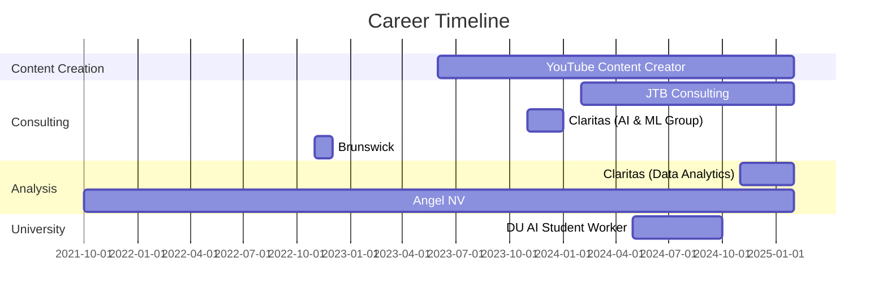

# Jared Briggs - Professional Portfolio


<div align="center">
    <a href="https://git.io/typing-svg">
        
    </a>
</div> 
<br>
<details open>
    <summary align="center"><h2>  Briefly about me </h2></summary>
    <p align="center"> I am a Data Analytics Professional and AI Enthusiast  from Reno, NV.</p>
    
    <h3>   A little more detail: </h3>
    <ul>
        <li><a>&nbsp; I am pursuing a Bachelor's in Business Information & Analytics at the University of Denver.</a></li><br>
        <li><a>&nbsp;  I am passionate about data analytics, AI, and data story telling.</a></li><br>
        <li><a>&nbsp; I enjoy staying active and playing sports.</a></li><br>
        <li><a>&nbsp; I am always adding new tools/skills to my repitoire.</a></li><br>
    </ul>
<br>
</details>


## Quick Navigation

<div align="center" style="display: flex; justify-content: center; gap: 15px; flex-wrap: wrap; margin-top: 20px;">

  <a href="#personal-website" 
     style="display: inline-block; padding: 10px 20px; background-color: #3498db; color: white; text-decoration: none; 
     border-radius: 25px; font-weight: bold; box-shadow: 2px 4px 6px rgba(0, 0, 0, 0.2); 
     transition: all 0.3s ease; margin: 5px;">
     Personal Website
  </a>

  <a href="#education-and-awards" 
     style="display: inline-block; padding: 10px 20px; background-color: #3498db; color: white; text-decoration: none; 
     border-radius: 25px; font-weight: bold; box-shadow: 2px 4px 6px rgba(0, 0, 0, 0.2); 
     transition: all 0.3s ease; margin: 5px;">
     Education & Awards
  </a>

  <a href="#latin-honors-portfolio" 
     style="display: inline-block; padding: 10px 20px; background-color: #3498db; color: white; text-decoration: none; 
     border-radius: 25px; font-weight: bold; box-shadow: 2px 4px 6px rgba(0, 0, 0, 0.2); 
     transition: all 0.3s ease; margin: 5px;">
     Latin Honors
  </a>

  <a href="#professional-experience" 
     style="display: inline-block; padding: 10px 20px; background-color: #3498db; color: white; text-decoration: none; 
     border-radius: 25px; font-weight: bold; box-shadow: 2px 4px 6px rgba(0, 0, 0, 0.2); 
     transition: all 0.3s ease; margin: 5px;">
     Experience
  </a>

  <a href="#skills" 
     style="display: inline-block; padding: 10px 20px; background-color: #3498db; color: white; text-decoration: none; 
     border-radius: 25px; font-weight: bold; box-shadow: 2px 4px 6px rgba(0, 0, 0, 0.2); 
     transition: all 0.3s ease; margin: 5px;">
     Skills
  </a>

</div>

---

## Personal Website

<div align="center">


</div>

Welcome to my professional portfolio! I am a data analytics and AI specialist with experience in consulting, analysis, and software development. Currently pursuing my Bachelor's degree in Business Information & Analytics at the University of Denver with a perfect 4.0 Major GPA, I've already established myself professionally through consulting work, data analysis, and creating successful online content.

### Connect With Me
[](https://www.linkedin.com/in/jared-briggs-312704257/)
[](https://github.com/yourusername)
[](https://youtube.com/@JaredBriggs)
[](mailto:1jaredbriggs@gmail.com)
[](tel:7024672204)

<div align="right">
  <a href="#jared-briggs---professional-portfolio">Back to Top ↑</a>
</div>

---

## Education and Awards

### Education
- **Daniels College of Business – University of Denver** - Bachelor of Science Business Administration in Business Information & Analytics, *June 2025*
  - GPA: 4.0
  - 2nd Place at DU AI Competition
  - Finalist at Entrepreneurship @ DU

### Competitions and Distinctions
| Competition/Award | Position | Year |
|-------------------|----------|------|
| DU Case Competition | 2nd Place | 2025 |
| DU AI Competition | 2nd Place | 2024 |
| Entrepreneurship @ DU | Finalist | 2024 |
| Madden Challenge - University of Denver | Team Leader | 2022 |

### Certifications
- **Microsoft Suite** - Excel, PowerPoint, Word
- **Azure AI Fundamentals**
- **Salesforce Data Analyst**

### LinkedIn Certifications
- Python for Data Science and Machine Learning
- Machine Learning in Mobile Applications

<div align="right">
  <a href="#jared-briggs---professional-portfolio">Back to Top ↑</a>
</div>

---

## Latin Honors Portfolio

<div align="center">
  
  
  
</div>

### Academic Achievements
Maintaining a perfect 4.0 Major GPA while balancing multiple professional positions demonstrates exceptional academic dedication and time management skills.

### Distinguished Projects
<details>
  <summary><strong>DU AI Competition - 2nd Place</strong></summary>
  
  #### Overview
  [Brief description of your AI project and the competition]
  
  #### Methodology
  [Description of your approach to the AI challenge]
  
  #### Results
  [Summary of your results that earned 2nd place]
  
  #### Technologies Used
  - Python
  - Machine Learning
  - [Other specific technologies]
</details>

<details>
  <summary><strong>Entrepreneurship @ DU - Finalist Project</strong></summary>
  
  #### Description
  [Details about your entrepreneurial project]
  
  #### Business Model
  [Overview of your business concept]
  
  #### Market Analysis
  [Summary of your market research]
  
  #### Outcome
  [Results of being a finalist and lessons learned]
</details>

<div align="right">
  <a href="#jared-briggs---professional-portfolio">Back to Top ↑</a>
</div>

---

## Professional Experience

<div align="center">
  


</div>

### Intern — Data Analytics Group | Claritas | November 2024 - Present


- Streamlined Salesforce pipeline optimizing data flow enabling the use of generative AI
- Worked on internal analytics focusing on customer retention & support, as well as evaluating employee performance
- **Technologies used:** Salesforce, Data Analytics, AI

### Software Consultant | JTB Consulting | February 2024 - Present


- Advised and consulted with more than six companies such as NPR, MMA Global, and J&J on artificial intelligence, machine learning, and automation
- Managed client expectations and delivered recommendations on time, improving client satisfaction scores by 22%
- **Technologies used:** AI, Machine Learning, Automation

### Analyst | Angel NV | October 2021 - Present


- Analyzed 100+ potential companies for investment and helped decide where 2+ million would be invested
- Conducted complex risk analysis narrowing 100 companies down to 10
- **Technologies used:** Risk Analysis, Financial Modeling

### Content Creator & YouTube Partner | YouTube | June 2023 - Present


- Amassed over 47 million views in a month, with a single day record of 2.6 million views
- Utilized machine learning models in conjunction with data modeling to achieve an average of 1,000+ new subscribers a day
- **Technologies used:** Machine Learning, Data Modeling, Content Strategy

### AI Student Worker | University of Denver | May 2024 - October 2024


- Created a mix of AI & machine learning models to make write ups 25% quicker with roughly 50% less errors
- Collaborated with nine employees to capture optimal business requirements
- **Technologies used:** AI, Machine Learning, Requirements Gathering

### Consultant — AI & Machine Learning Group | Claritas | November 2023 - January 2024


- Utilized AI to build a custom RAG internal tool to streamline production & automate work leading to 50% task completion speed
- Completed tasks 10% quicker than expected and presented final product to CEO
- **Technologies used:** AI, RAG, Automation

### Consultant — Data Analytics Division | Brunswick | November 2022 - December 2022


- Segmented 10,000+ data points and segmented 1000s of zip codes into custom segments
- Utilized existing pipelines, streamlined data and reduced volume and load by roughly 35%
- **Technologies used:** Data Analytics, Segmentation, Pipeline Optimization

### Leadership Experience

- **Sales Club - University of Denver**, *Vice-President DEI* (December 2023 – Present)
- **Madden Challenge - University of Denver**, *Team Leader* (August 2022 – November 2022)

<div align="right">
  <a href="#jared-briggs---professional-portfolio">Back to Top ↑</a>
</div>

---

## Skills

<div align="center">

### Technical Skills


### Data & AI Tools


</div>

### Skill Proficiency

```
Programming Languages
├── Python     ████████████░ 95%
├── JavaScript ███████████░░ 90%
├── Java       ██████████░░░ 80%
├── TypeScript ███████████░░ 90%
└── R          ████████░░░░░ 70%

Data & Analytics
├── SQL        ███████████░░ 90%
├── Pandas     ████████████░ 95%
├── NumPy      ████████████░ 95%
├── Tableau    ███████████░░ 90%
└── Power BI   ██████████░░░ 80%

AI & Machine Learning
├── TensorFlow ███████████░░ 90%
├── PyTorch    ██████████░░░ 80%
├── RAG Systems██████████░░░ 80%
└── ML Modeling████████████░ 95%
```

### Certifications
- Microsoft Suite (Excel, PowerPoint, Word)
- Azure AI Fundamentals
- Salesforce Data Analyst
- Python for Data Science and Machine Learning
- Machine Learning in Mobile Applications

<div align="right">
  <a href="#jared-briggs---professional-portfolio">Back to Top ↑</a>
</div>

---

<div align="center">
  <p>This portfolio is maintained using GitHub Actions for automatic deployment.</p>
  <p>Last updated: February 2025</p>
</div>
