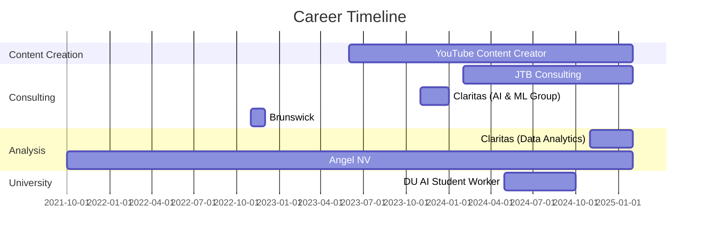

# Jared Briggs - Professional Portfolio


<div align="center">
    <a href="https://git.io/typing-svg">
        
    </a>
</div> 

## ⚡ Quick Navigation


<a href="#education">
    
</a>
<a href="#latin-honors-portfolio">
    
</a>
<a href="#prof-exp">
    
</a>
<a href="#skills">
    
</a>


<br>
<details open>
    <summary align="center"><h2>  Briefly about me </h2></summary>
    <p align="center"> I am a Data Analytics Professional and AI Enthusiast.</p>
    
    <h3>   A little more detail: </h3>
    <ul>
        <li><a>&nbsp; I am pursuing a Bachelor's in Business Information & Analytics at the University of Denver.</a></li><br>
        <li><a>&nbsp;  I am passionate about data analytics, AI, and data story telling.</a></li><br>
        <li><a>&nbsp; I enjoy staying active and playing sports.</a></li><br>
        <li><a>&nbsp; I am always adding new tools/skills to my repitoire.</a></li><br>
    </ul>
<br>
</details>


<div align="center">
  <h2>🌐 Personal Website 🌐</h2>
  <p>
    <a href="https://jbubb101.github.io/JaredsPortfolio/">
      
    </a>
  </p>
</div>


## Education and Awards

### Education
- **Daniels College of Business – University of Denver** - Bachelor of Science Business Administration in Business Information & Analytics, *June 2025*
  - GPA: 4.0
  - 2nd Place at DU AI Competition
  - Finalist at Entrepreneurship @ DU

### Competitions and Distinctions
| Competition/Award | Position | Year |
|-------------------|----------|------|
| DU Case Competition | 2nd Place | 2025 |
| DU AI Competition | 2nd Place | 2024 |
| Entrepreneurship @ DU | Finalist | 2024 |
| Madden Challenge - University of Denver | Team Leader | 2022 |

### Certifications
- **Microsoft Suite** - Excel, PowerPoint, Word
- **Azure AI Fundamentals**
- **Salesforce Data Analyst**

### LinkedIn Certifications
- Python for Data Science and Machine Learning
- Machine Learning in Mobile Applications

<div align="right">
  <a href="#jared-briggs---professional-portfolio">Back to Top ↑</a>
</div>

---

## Latin Honors Portfolio

<div align="center">
  
  
  
</div>

### Academic Achievements
Maintaining a perfect 4.0 Major GPA while balancing multiple professional positions demonstrates exceptional academic dedication and time management skills.

### Distinguished Projects
<details>
  <summary><strong>DU AI Competition - 2nd Place</strong></summary>
  
  #### Overview
  [Brief description of your AI project and the competition]
  
  #### Methodology
  [Description of your approach to the AI challenge]
  
  #### Results
  [Summary of your results that earned 2nd place]
  
  #### Technologies Used
  - Python
  - Machine Learning
  - [Other specific technologies]
</details>

<details>
  <summary><strong>Entrepreneurship @ DU - Finalist Project</strong></summary>
  
  #### Description
  [Details about your entrepreneurial project]
  
  #### Business Model
  [Overview of your business concept]
  
  #### Market Analysis
  [Summary of your market research]
  
  #### Outcome
  [Results of being a finalist and lessons learned]
</details>

<div align="right">
  <a href="#jared-briggs---professional-portfolio">Back to Top ↑</a>
</div>

---

## Professional Experience

<div align="center">
  


</div>


---

## Skills

<div align="center">

### Technical Skills


### Data & AI Tools


</div>

### Skill Proficiency

```
Programming Languages
├── Python     ████████████░ 95%
├── JavaScript ███████████░░ 90%
├── Java       ██████████░░░ 80%
├── TypeScript ███████████░░ 90%
└── R          ████████░░░░░ 70%

Data & Analytics
├── SQL        ███████████░░ 90%
├── Pandas     ████████████░ 95%
├── NumPy      ████████████░ 95%
├── Tableau    ███████████░░ 90%
└── Power BI   ██████████░░░ 80%

AI & Machine Learning
├── TensorFlow ███████████░░ 90%
├── PyTorch    ██████████░░░ 80%
├── RAG Systems██████████░░░ 80%
└── ML Modeling████████████░ 95%
```

### Certifications
- Microsoft Suite (Excel, PowerPoint, Word)
- Azure AI Fundamentals
- Salesforce Data Analyst
- Python for Data Science and Machine Learning
- Machine Learning in Mobile Applications

<div align="right">
  <a href="#jared-briggs---professional-portfolio">Back to Top ↑</a>
</div>

---

</details>

<div align="center">

###  Connect With Me 
[](https://www.linkedin.com/in/jared-briggs-312704257/)
[](https://github.com/jbubb101)
[](mailto:1jaredbriggs@gmail.com)


