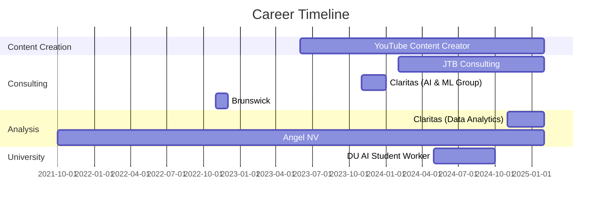

<a id="readme-top"></a>


<div align="center">
    <a href="https://git.io/typing-svg">
        
    </a>
</div> 

## ⚡ Quick Navigation


<a href="#education">
    
</a>
<a href="#latin-honors">
    
</a>
<a href="#professional-experience">
    
</a>
<a href="#skills">
    
</a>


<br>
<details open>
    <summary align="center"><h2>  Briefly about me </h2></summary>
    <p align="center"> I am a Data Analytics Professional and AI Enthusiast.</p>
    
    <h3>   A little more detail: </h3>
    <ul>
        <li><a>&nbsp; I am pursuing a Bachelor's in Business Information & Analytics at the University of Denver.</a></li><br>
        <li><a>&nbsp;  I am passionate about data analytics, AI, and data story telling.</a></li><br>
        <li><a>&nbsp; I enjoy staying active and playing sports.</a></li><br>
        <li><a>&nbsp; I am always adding new tools & skills to my repertoire.</a></li><br>
    </ul>
    
<div align="center" style="background-color: #f5f5f5; padding: 20px; border-radius: 10px; margin: 20px 0;">
        <h3>🌟 My Ethos 🌟</h3>
        <p style="font-style: italic; font-size: 18px;">
            I transform complex data into actionable insights that drive business decisions. Combining technical analytics expertise with strategic business understanding, I bridge the gap between data and meaningful outcomes. I'm seeking roles where I can leverage advanced analytics and AI to solve challenging business problems and create measurable impact.
        </p>
    </div>
    <br>
</details>


<div align="center">
  <h2>🌐 Personal Website 🌐</h2>
  <p>
    <a href="https://jbubb101.github.io/JaredsPortfolio/">
      
    </a>
  </p>
</div>

<a id="education"></a>
## 🏆 Education and Awards 
### Education
- **Daniels College of Business – University of Denver** - Bachelor of Science Business Administration in Business Information & Analytics, *June 2025*
  - Major GPA: 4.00, Cumulative GPA: 3.91
### Competitions and Distinctions
| Competition/Award | Position | Year |
|-------------------|----------|------|
| DU Case Competition | 2nd Place | 2025 |
| DU AI Competition | 2nd Place | 2024 |
| Marketing Case Competition | 1st Place | 2023|
| Entrepreneurship @ DU | Finalist | 2022 |
| Madden Challenge - University of Denver | Team Leader | 2022 |
### Certifications
- **Microsoft Suite** - Excel, PowerPoint, Word
- **Azure AI Fundamentals**
- **Salesforce Data Analyst**
### LinkedIn Certifications
- Python for Data Science and Machine Learning
- Machine Learning in Mobile Applications

<div align="center">
  
  <p><em>2nd Place - DU Business Olympics (2025)</em></p>
</div>

<div align="right">
  <a href="#readme-top">
    
  </a>
</div>

---
<a id="latin-honors"></a>
## 🎓 Daniels Distinction & Latin Honors

<div align="center">
  <a href="https://github.com/jbubb101/Latin_Honors_dataset_1">
    
  </a>
</div>

### Daniels Distinction
The Daniels Distinction & Latin Honors program recognizes undergraduate students at the Daniels College of Business who a achieve a GPA at or above 3.85, complete an application, meet with a faculty advisor, and create a research portfolio

### Distinguished Projects
<details>
  <summary><strong>Latin Honors Portfolio</strong></summary>
  
  #### Overview
The focus of my project was on optimizing student retention and throughput for universities. I worked on developing a predictive model that could not only forecast student dropouts but also identify the key factors that contribute to students transferring or leaving a university. By conducting in-depth research and analyzing various data points, my goal was to uncover patterns and trends that influence student retention. This project aimed to provide universities with actionable insights to improve student support systems and create a more effective learning environment.
  

 #### Methodology  
To develop a comprehensive predictive model, I utilized multiple datasets from various countries, ensuring a diverse and representative sample of student data. This approach allowed me to analyze student retention and dropout patterns across different educational systems, helping to identify common denominators among universities worldwide. The methodology involved several key steps:  

1. **Data Collection and Preprocessing** – I gathered publicly available and institutional datasets containing student demographic information, academic performance records, financial data, and engagement metrics. These datasets were cleaned, normalized, and preprocessed to remove inconsistencies, missing values, and irrelevant features.  

2. **Feature Selection and Engineering** – I identified key variables that could influence student retention, such as socioeconomic status, GPA, attendance records, financial aid, and extracurricular involvement. Feature engineering techniques were applied to create new meaningful predictors that could enhance the model’s performance.  

3. **Exploratory Data Analysis (EDA)** – I performed statistical analysis and data visualization techniques to uncover trends and correlations between different factors and student outcomes. This step helped validate assumptions and refine the selection of important features.  

4. **Model Development** – I experimented with various machine learning algorithms, including logistic regression, decision trees, random forests, and neural networks, to predict dropout risks and potential transfers. The models were trained using historical student data and validated through cross-validation techniques to ensure accuracy and generalizability.  

5. **Model Evaluation and Optimization** – I used performance metrics such as accuracy, precision, recall, and F1-score to assess the effectiveness of different models. Hyperparameter tuning was performed to optimize the model’s predictive power, and feature importance analysis was conducted to identify the most influential factors contributing to student dropouts.  

6. **Cross-Country Comparisons** – By analyzing data from multiple countries, I was able to compare and contrast the factors affecting student retention globally. This helped determine whether certain dropout risks were universal or specific to particular regions or education systems.  

7. **Implementation and Recommendations** – Based on the findings, I formulated recommendations for universities to enhance their student support initiatives, improve academic counseling, and implement targeted intervention programs to reduce dropout rates.  

This structured methodology ensured that the predictive model was robust, interpretable, and adaptable for use across various educational institutions.

#### Results  
Not only was I able to predict the likelihood of a student dropping out with approximately 75% accuracy, but I also developed a simple yet effective model that could proactively identify at-risk students. This model not only flagged students who were likely to drop out but also provided insights into the specific factors contributing to their risk, allowing for targeted interventions. Additionally, I designed a system that could facilitate early outreach, enabling universities to connect with these students through academic advising, financial aid support, or mental health resources. By implementing this approach, universities could take proactive measures to improve student retention, enhance overall throughput, and create a more supportive learning environment.
  
  #### Technologies Used
  - Python
  - Pandas & NumPy
  - Machine Learning
  - OpenAI
</details>


<div align="right">
  <a href="#readme-top">
    
  </a>
</div>


---
<a id="professional-experience"></a>
## 💼 Professional Experience

<div align="center">
  


</div>


---

## 💡Skills

<div align="center">

### Technical Skills


### Data & AI Tools


</div>

### Skill Proficiency

```
Programming Languages
├── Python     ████████████░ 95%
├── JavaScript ███████████░░ 90%
├── Java       ████████░░░░░ 80%
├── TypeScript ███████████░░ 90%
└── R          ███████░░░░░░ 70%

Data & Analytics
├── SQL        ████████████░ 95%
├── Pandas     ████████████░ 95%
├── NumPy      ███████████░░ 90%
├── Tableau    ███████████░░ 90%
└── Power BI   ████████░░░░░ 80%

AI & Machine Learning
├── TensorFlow ████████░░░░░ 80%
├── PyTorch    ███████████░░ 90%
├── RAG Systems████████░░░░░ 85%
└── ML Modeling████████░░░░░ 85%
```


---

</details>

<div align="right">
  <a href="#readme-top">
    
  </a>
</div>

<div align="center">

###  Connect With Me 
[](https://www.linkedin.com/in/jared-briggs-312704257/)
[](https://github.com/jbubb101)
[](mailto:1jaredbriggs@gmail.com)


